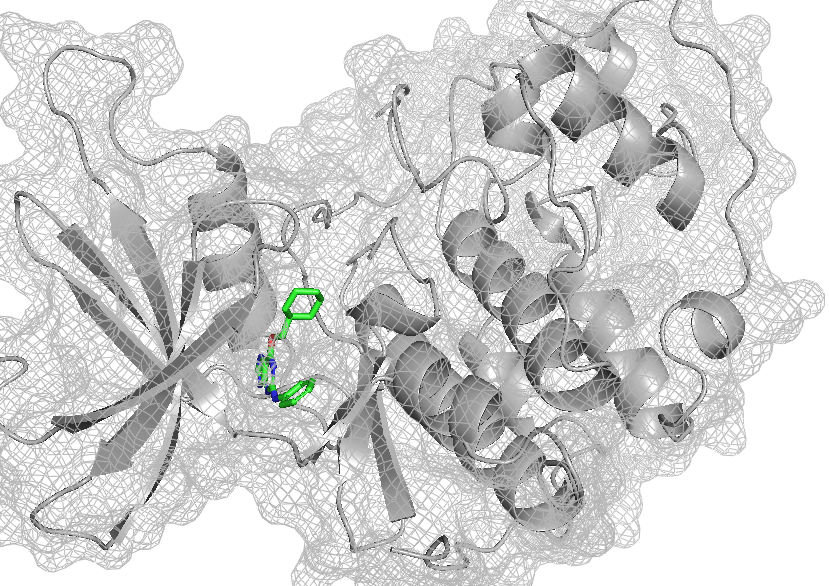
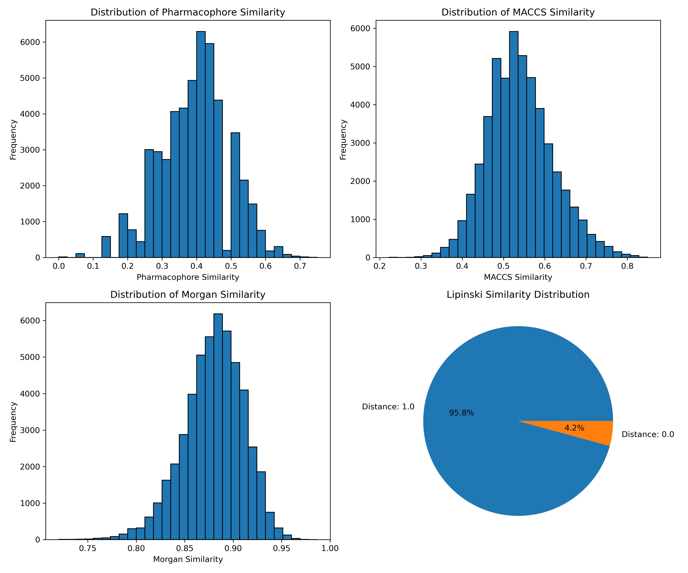
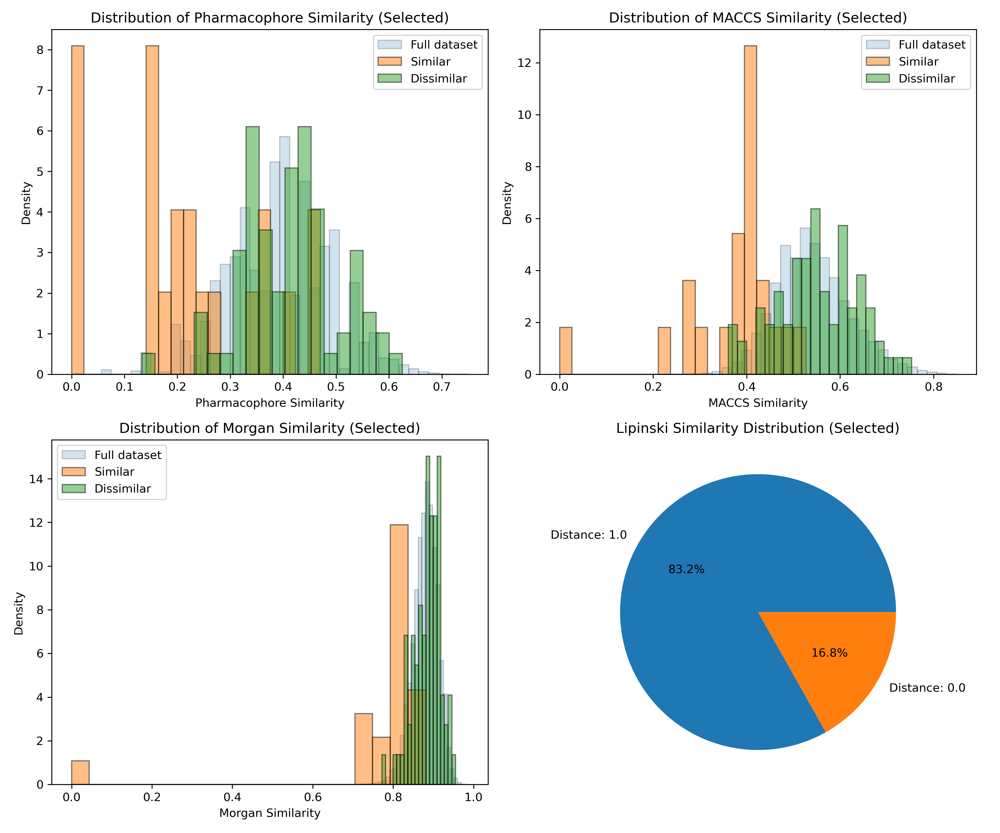
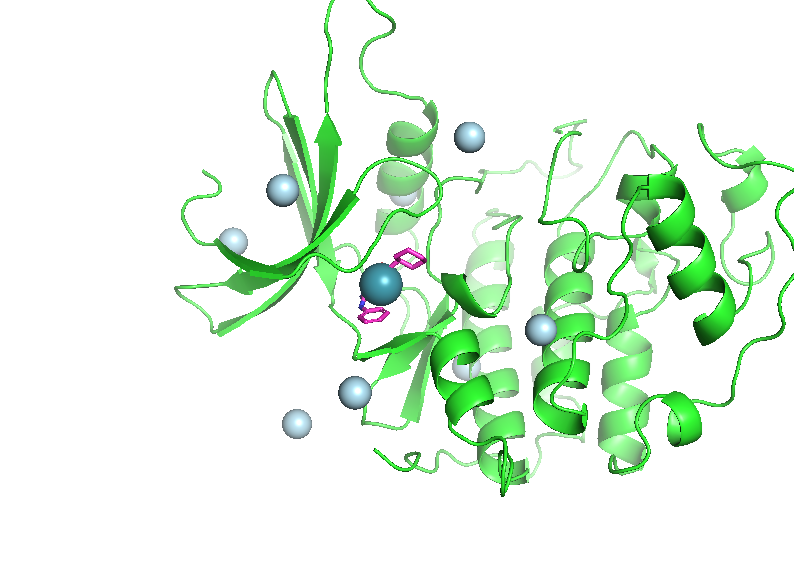
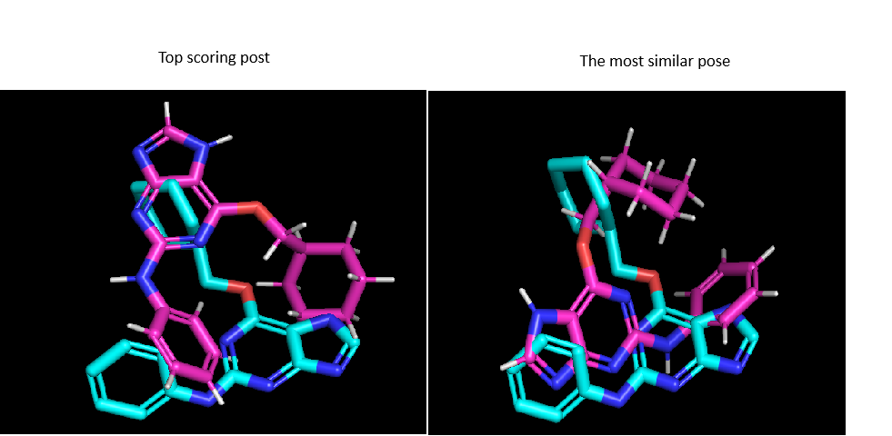
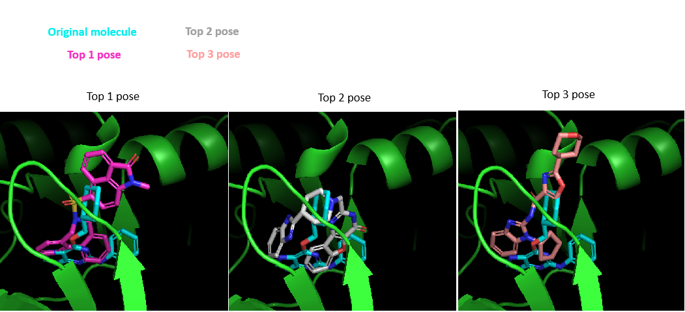
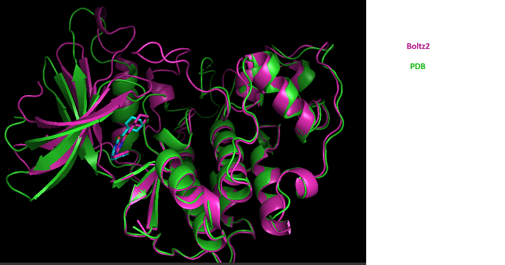
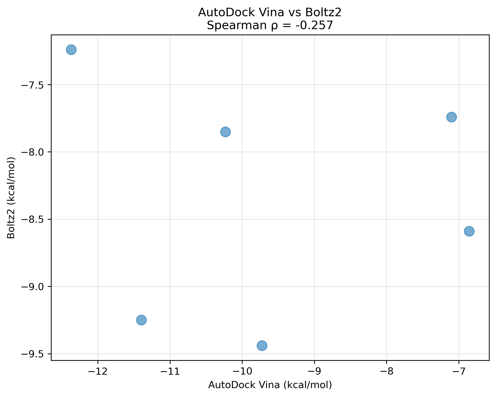
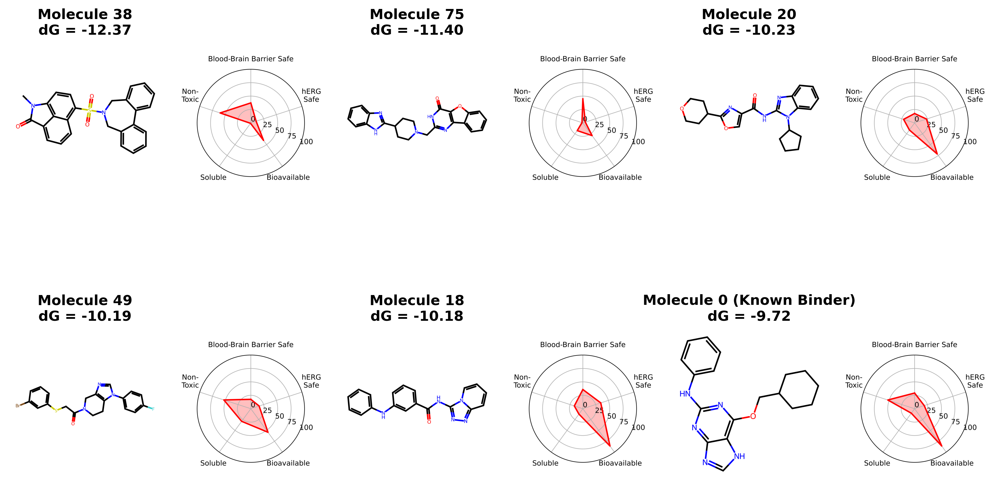

# Docking Pipeline

This is the overview of steps taken to run a simple docking task with `AutoDock Vina` and `DiffDock` on *1H1Q*.

Summary slide is available [here](Docking_to_1H1Q_with_open_source_tools.pptx). The same summary is at the [end](#summary) of readme.

## 1. Complex downloading.

For this part we use environment `venvs/strucutre_loading/venv`. It can be created with

> I am using `mamba`, but `conda` or other `poetry` or any package manager can be used.

```bash
mamba create -p venvs/structure_loading/venv python=3.12
mamba activate venvs/structure_loading/venv
mamba install --file venvs/structure_loading/requirements.txt
```

> In sake of speed I am not providing unittests for all the routines used. I understand, that this is a bad practice, but for a test task I made a decision to skip this step. In general, I would try to cover all the functionality with unittest, and additionally provide some regression testing as well. Typically, I would use `unittest` or `pytest`, and design a `CI/CD` pipeline for automatic testing and deployment.

Then, we can use [`docking_pipeline/structure_downloading.py`](docking_pipeline/structure_downloading.py) script to download the structure: 

```bash
python docking_pipeline/structure_downloading.py -p 1h1q -o pipeline_output/structure_downloading
```
Alongside structure downloading, we perform some basic parsing: we save every protein chain into a separate `.pdb`, and every small molecule entity as a separate `.sdf` file. We extract bond information from `_chem_comp_bond` secion of the downloaded `.cif` file. All the output for this step is saved to [`pipeline_output/structure_downloading`](pipeline_output/structure_downloading) folder. The logging information is in [`structure_loading.log`](pipeline_output/structure_downloading/structure_loading.log) file.

In short, we downloaded the structure with PDB ID `1H1Q`. There are 4 protein chain. For all future work, we need to select only a single symmetric copy. We will also avoid using Cyclin E in our computational pipeline (to keep things fast). We got the following files:

```
Downloading PDB structure '1h1q'...
WARNING: Multiple protein chains (4) found: ['A', 'B', 'C', 'D']
Each chain will be saved separately.
Chain A -> pipeline_output/structure_downloading/1h1q_protein_chain_A.pdb
Chain B -> pipeline_output/structure_downloading/1h1q_protein_chain_B.pdb
Chain C -> pipeline_output/structure_downloading/1h1q_protein_chain_C.pdb
Chain D -> pipeline_output/structure_downloading/1h1q_protein_chain_D.pdb
WARNING: Multiple ligands (4) found in structure!
Manual selection will be required for downstream processing.
Ligand 1: TPO -> pipeline_output/structure_downloading/1h1q_ligand_TPO_1.sdf
Ligand 2: 2A6 -> pipeline_output/structure_downloading/1h1q_ligand_2A6_2.sdf
Ligand 3: TPO -> pipeline_output/structure_downloading/1h1q_ligand_TPO_3.sdf
Ligand 4: 2A6 -> pipeline_output/structure_downloading/1h1q_ligand_2A6_4.sdf
Structure processing complete for 1h1q
Original structure: pipeline_output/structure_downloading/1h1q.cif
Protein (PDB): ['pipeline_output/structure_downloading/1h1q_protein_chain_A.pdb', 'pipeline_output/structure_downloading/1h1q_protein_chain_B.pdb', 'pipeline_output/structure_downloading/1h1q_protein_chain_C.pdb', 'pipeline_output/structure_downloading/1h1q_protein_chain_D.pdb']
Ligand (SDF): ['pipeline_output/structure_downloading/1h1q_ligand_TPO_1.sdf', 'pipeline_output/structure_downloading/1h1q_ligand_2A6_2.sdf', 'pipeline_output/structure_downloading/1h1q_ligand_TPO_3.sdf', 'pipeline_output/structure_downloading/1h1q_ligand_2A6_4.sdf']
```
For our future analysis we will use [`1h1q_protein_chain_A.pdb`](pipeline_output/structure_downloading/1h1q_protein_chain_A.pdb) protein structure and [`pipeline_output/structure_downloading/1h1q_ligand_2A6_2.sdf`](pipeline_output/structure_downloading/1h1q_ligand_2A6_2.sdf) ligand file. We also copied them to [`ligand_selection/input`](pipeline_output/ligand_selection/input) folder. The selected ligand and protein complex form a nice protein complex:



## 2. Ligand selection

For generating the library, I used the [Enamine Discovery Diversity Set](https://enamine.net/compound-libraries/diversity-libraries/dds-50240). The SMILES for all the molecules are in [`ligand_selection/input` folder](pipeline_output/ligand_selection/input/Enamine_Discovery_Diversity_Set_50_plated_50240cmpds_20251019.smiles). For every compound, there are a few important properties already calculated:

```
SMILES	Catalog ID	MW	MW (desalted)	ClogP	logS	HBD	HBA	TPSA	RotBonds	AnalogsFromREAL
CC(NC(=O)C=1C=CC=2N=CC=NC2C1)C(=O)NCC=3C=CC=CC3	Z811576954	334.373	334.373	2.025	-3.337	2	4	83.98	5	https://real.enamine.net/public-enum-files/Z811576954
CN1CCC2(CCCN2C(=O)COC=3C=CC=4NC(=O)CCC4C3)CC1	Z1565106802	357.448	357.448	0.936	-2.396	1	4	61.88	3	https://real.enamine.net/public-enum-files/Z1565106802
CC1CN(C(=O)C2=CSC(=N2)C=3C=NN(C3)C=4C=CC=CC4)C(C)CN1C	Z1565141231	381.497	381.497	3.209	-3.558	0	4	54.26	3	https://real.enamine.net/public-enum-files/Z1565141231
NC=1N=CC=C(N1)C2CCCN(C2)C(=O)C3=CSC(=N3)C4CC4	Z2075879758	329.422	329.422	0.563	-3.059	1	5	85	4	https://real.enamine.net/public-enum-files/Z2075879758
```

Keeping track of such properties as `ClogP`, `logS`, `HBD`, `HBA`, `TPSA` is important during drug discovery projects. While they are not critical, they can be quite informative and helpful in making decision.

We well compute some scores for all the molecules in this dataset. This scores will reflect pharmacophores, chemical similarity to reference molecule, and some more classical Lipinski-based properties. For that we will create environment first,

```bash
mamba create -p venvs/ligand_selection/venv python=3.12
mamba activate venvs/ligand_selection/venv
mamba install --file venvs/ligand_selection/requirements.txt
```

> We should note here, that we will be computing some more classcal metrics. But in principle, some advanced metric for identifying similarity can be computed as well. For instance, shape similarity with packages like [`roshambo`](https://github.com/molecularinformatics/roshambo) or [`espsim`](https://github.com/hesther/espsim). Or AI based embeddings to define the latent-space representation of molecules can be used.

For about 50000 molecules from Enamine set, we will select molecules based on 4 criteria:

1. **Pharmacophore similarity**. We will extract pharmacophores from the reference molecule and compare this set with pharmacophores of molecules from the library. This should provide us with an idea how similar the interactions formed by the molecules can be.

    > Note, that to keep the compuation relatively short, we don't take into account positions of pharmacophores, we just compare families.
2. **Tanimoto or Jaccard's distance**. We will compute tanimoto distance ($1-TS$, where $TS$ is Tanimoto Similarity). We compute two types of Tanimoto distances, based on Morgan fingerprints, and more classical MACCS.
3. **Lipinski distance**. This is a very simple additional metric, which simple says that two molecules are identical if they have
 - Similar number of hydrogen donnors ($|N_{1}^{\text{HBD}}-N_{2}^{\text{HBD}}| < 2$)
 - Similar number of hydrogen acceptors ($|N_{1}^{\text{HBA}}-N_{2}^{\text{HBA}}| < 2$)
 - Similar number of rotatable bonds ($|N_{1}^{\text{rot.b.}}-N_{2}^{\text{rot.b.}}| < 3$)
 - Comparable molecular weight ($\frac{2*(m1-m2)}{m1 + m2} < 0.2$)
 - Comparable CLogP ($\frac{2*(p1-p2)}{p1 + p2} < 0.1$)

Overall, the metrics are distributed as shown in the plot (all the metrics can be checked in [`similarity_scores.csv` file](pipeline_output/ligand_selection/similarity_scores.csv)):



 When all the metrics are computed we select the top 3 molecules by pharmacophore, Morgan Tanimoto, and MACCS Tanimoto distances. Also, we randmoly select 11 molecules that are within lowest 10 percent for these 3 metrics, and additionally have Lipinski dinstance 0. We also randomly select 80 molecules from the highest 90 percent. Thus, we will have 20 similar molecules and 80 dissimilar ones. We also include the original molecule to our dataset, to see if docking can recognize it out of all the other ones. For the selected molecules the distribution of similarity metrics is as follows:

 

It can be seen, that similar molecules have shifted distributions, while dissimilar resemble the full dataset more closely. It is interesting, that different similarity metrics highlight different compounds. While this is not a problem for our task, it emphasizes that the strategy of including different properties is beneficial, since different metrics focus on different properties of the molecules and thus, combination of those is more likely to help in choosing compounds similar to reference.

 All the selection process can be run with

 ```bash
 python docking_pipeline/ligand_selection.py -l pipeline_output/ligand_selection/input/1h1q_ligand_2A6_2.sdf -s pipeline_output/ligand_selection/input/Enamine_Discovery_Diversity_Set_50_plated_50240cmpds_20251019.smiles -o pipeline_output/ligand_selection
 ```

 > It is important to note, that we cut some edges in the library generation. Ideally, you would compute more properties and have a bigger library. Depending on the goal, the properties of interest can be different. For instance, if the goal is to change the core of the molecule - this is one scenario, some other metrics should be used. Typically, for a screening campaign you might want to select as diverse molecules as you can. In this case it is worth using a bigger initial library and cluster it first, to get a subset of representatives. Then, you might want your library to be testable in some assay, this might add additional requirements on the molecules, which can also be used as filters. You additionally might want to mimick you HTS library, and thus for the VS library you might want to compute the distributions of properties you consider important.

 The [`.log` file](pipeline_output/ligand_selection/ligand_selection.log) from ligand selection step, demonstrates how long calculation of every property takes. The list of output ligands is in [`selected_ligands.csv` file](pipeline_output/ligand_selection/selected_ligands.csv)

 ## 3. Docking

We will perform docking with classical pipeline (`autodock-vina`) and with ML pipeline (`Boltz2`).

> I should say here, that I am a bit biased. Currently, we use in-house docking tool for docking, and we never use docking scores for macking any decisions on the projects. Also, ou our internals set, `Boltz2` affinity prediction module demonstrated 0 correlation. However, I think that scores can be more meaningful for the classical strcuture we used, since it most probably was used for training and optimization of all the comp-pipelines a lot. Overall, I think that currently the most robust affinity prediction tool is FEP (or something similar).

### 3.1. Classical docking with `AutoDock-Vina`

As usual, we start by creating envirnoment:

```bash
cd venvs/autodock-vina
mamba env create --prefix venvs/autodock-vina/venv --file venvs/autodock-vina/env.yaml
mamba activate venvs/autodock-vina/venv
```

Before running docking, we need to have all the ligands in `.sdf` format. For that, we will generate 5 conformers with rdkit for each selected ligand. This can be done with the [`generate_ligand_conformations.py` script](docking_pipeline/generate_ligand_conformations.py):

```bash
python docking_pipeline/generate_ligand_conformations.py -c pipeline_output/docking/input/selected_ligands.csv -n 5 -o pipeline_output/docking/autodock-vina
```

This script will generate conformations for all ligands in the [`selected_ligands.csv` file](pipeline_output/ligand_selection/selected_ligands.csv). Output conformations are in [`conformations` folder](pipeline_output/docking/autodock-vina/conformations) and paths to conformers are written to [`conformers.csv`](pipeline_output/docking/autodock-vina/conformers.csv).

> Note, that here we only generate conformations. In principle, we should also cluster those conformations, and consider different protonation states/tautomers. There are many tools for doing this. I am skipping this step here.

When conformations are ready, we need to prepare complex and all ligands. For that, we will use `Meeko` scripts. We will use some default options, though for better results some manual protein preparaion might be needed.

> Note, that current implementation is far from optimal. We are doing everything molecule by molecule, though it can be faster to initialize a single `Preparator` object and then apply it to a list of molecules. Additionally, we can make use of some software engineering to speed things up. But for a small library like ours it is not a huge problem.

After preparation of both protein and ligand molecules we can run docking. In our case we will use rigid docking with `vina` force field. We will generate 5 poses per conformer. This choice is again made to save some computational resources. With more efficient implementation and more resources available we can use more expensive options (flexible docking, etc.).

All the pipeline is run with a single command-line command:

```bash
python docking_pipeline/autodock_vina.py -p pipeline_output/docking/input/1h1q_protein_chain_A.pdb -l pipeline_output/docking/input/1h1q_ligand_2A6_2.sdf -o pipeline_output/docking/autodock-vina -c pipeline_output/docking/autodock-vina/conformers.csv -d pipeline_output/docking/input/selected_ligands.csv
```
All the parameters are logged in [log file](/home/pbuslaev/projects/personal/docking_pipeline/pipeline_output/docking/autodock-vina/autodock-vina.log). The docking box is saved to [box file](pipeline_output/docking/autodock-vina/receptor.box.txt). The box can be visualized in `pymol` or any other graphical molecular software:



Docking box nicely packs the original ligand.

All the docking poses in both `.pdbqt` and `.sdf` formats are in [`docking_structures` foler](pipeline_output/docking/autodock-vina/docking_structures).

Now, we can analyse the obtained results. First of all, we can check the docked poses for original ligand. How close they are to experimental data?



The top-scoring poses are quite different from experimental one, and while the second pose is the one closest to the experimental one, the core is still flipped. Thus, `autodock-vina` was not able to restore the correct pose of original ligand.

> In principal, this result is more or less expected. To get best outcome from docking you might want to use pharmacophore/MCS constraints. We are not doing it here. For our exercise MCS docking is not suitable, since we are generating a diverse library. MCS docking is good at the lead stages, when you are trying to optimize the molecule by small changes and keeping the core. For the initial stages (hit-identification) pharmacophore constraints are more suitable. The hope was, that if we select molecules with similar pharmacophores, `autodock-vina` is able to correctly place those without constraints, but this is clearly not the case.

Anyhow, we can try to make use of docking scores obtained. Let's see if `autodock-vina` was able to rank original and similar molecules high, compared to very different molecules. For that, we will extract the docking scores. We will only focus on the top score across different conformations for a particular molecule, and we will directly compare scores between ligands. To run the analysis we can call:

```bash
python docking_pipeline/analyze_autodock_vina_results.py -d pipeline_output/docking/autodock-vina/docked.csv -o pipeline_output/docking/autodock-vina/docking_results
```

All the steps for the analysis are logged [here](pipeline_output/docking/autodock-vina/docking_results/docking_analysis.log). The results are saved to [`best_results.csv` file](pipeline_output/docking/autodock-vina/docking_results/best_results.csv). We simplified the analysis a lot. We were only looking at the top scoring pose among all conformers. Thus, we only focused on a single pose per molecule. The ranking of the compounds can be seen in the plot:


Overall, results are ok. Original molecule was ranked 12th, and there are 4 similar to original molecules in the best 10. One would expect a similar molecule to rank high. We only had 20% of similar molecules in our library, and we have 40% in the top 10. Thus, a simple docking pipeline would suggest some early enrichment, which is expected from the VS campaigns. It is useful to take a look at the top 3 molecules and compare them to the original molecule.



First two molecules, which seem to be the most potent according to `autodock-vina` sort of resemble the pharmacophore placement of the original molecule, but it is worth digging a bit deeper into some interaction patterns. We will focus on that in later sections.

### 3.2. ML-based docking with `Boltz2`

After running classicals docking we will now focused on AI-based docking with `boltz2`. 

> I used local GPUs to run the model, thus it might be a bit complicated to fully reproduce my enviromnent, but hopefully, it is not a big issue. I am providing instructions to install `boltz2` for cpu-only use, since it was reproducible accross several machines, while cuda-env was not.

We start by creating environment:

```bash
mamba env create -p venvs/boltz2/venv --file venvs/boltz2/env.yaml
mamba activate venvs/boltz2/venv
pip install boltz  # for cuda version I used pip install boltz[cuda]
```

> Note, that tipically `boltz` dependency can be added to `env.yaml` file within pip section. Due to some specific choices, on my machine `mamba` fails to install any pip dependencies from `yaml` files. Thus, I am adding this dependency manually.

To run `boltz` we need protein sequence, ligand smiles, and constraints. The small problem, is that while preparing protein for docking with `autodock-vina` we made a choice to remove unnatural amino acid **TPO** from the sequence and now we have a gap in the sequence. Since in the original structure **TPO** is quite far from the binding pocket this should not be a problem and we will modify it with **ALA** in the sequence for `boltz` predictions.

First of all, we need to prepare config file for `boltz`. We do this with [`run_boltz2.py` script](docking_pipeline/run_boltz2.py). This will generate `boltz` `config` [file](pipeline_output/docking/boltz2/boltz_config.yaml):

```yaml
sequences:
- protein:
    id: [A]
    sequence: SMENFQKVEKIGEGTYGVVYKARNKLTGEVVALKKIRLDTETEGVPSTAIREISLLKELNHPNIVKLLDVIHTENKLYLVFEFLHQDLKKFMDASALTGIPLPLIKSYLFQLLQGLAFCHSHRVLHRDLKPQNLLINTEGAIKLADFGLARAFGVPVRTYAHEVVTLWYRAPEILLGCKYYSTAVDIWSLGCIFAEMVTRRALFPGDSEIDQLFRIFRTLGTPDEVVWPGVTSMPDYKPSFPKWARQDFSKVVPPLDEDGRSLLSQMLHYDPNKRISAKAALAHPFFQDVTKPVPHL
- ligand:
    id: [B]
    smiles: c1ccc(Nc2nc(OCC3CCCCC3)c3[nH]cnc3n2)cc1
constraints:
- pocket:
    binder: B
    contacts: [[A, 82], [A, 84], [A, 85], [A, 132]]
    force: true
properties:
- affinity: {binder: B}
```

> Unfortunately, none of machines available to me were able to run `boltz` directly due to memory limitations. So I wasn't able to run it on my own. I used [tamarind](https://app.tamarind.bio/) to run a few examples.

First of all, we tested `boltz` with the original ligand. Overall, the prediction is ok. The ligand is placed fine and there are only minor deviations in protein structure, far from the binding pocket:



Next, we try to see if affinity predictions between classical and AI based methods correlate. For that we will run the predictions on top 3 and worst 2 molecules as predicted by `autodock-vina`, we also include original molecule.
We will use suggested equation from boltz developers to estimate dG: $-(6-y) * 1.363$, where $y$ is `boltz` prediction.

| Molecule rank | Vina score | Boltz converted score |
| --- | --- | --- |
| 12 | -9.725 | -9.44 |
| 1 | -12.37 | -7.24|
| 2 | -11.398 | -9.25|
| 3 | -10.233 | -7.85|
| 100 | -7.1 | -7.74 |
| 101 | -6.855 | -8.59|

As can be clearly seen, there is almost no correlation between `vina` and `boltz2` scores:

.

Interestingly, among all those molecules, original molecules has the best score with Boltz2. At the same time the range of predicted affinities is much smaller. This is a common thing for `boltz`. Overall, the ideal strategy could be to generate poses with `boltz` and then rescore those with `vina`. However, due to computational resources limitation I can't do it. It is also worth mentioning, that most probably `boltz` has seen the structure we are using during training, since it was deposited before the training cutoff. Therefore, its good structure predictoin is not really surprising. In my experience, when there are similar proteins in pdb, predictions are good, but with 0 examples, predictions can be significantly worse than from docking.

## 4. Additional properties

Since, unfortunately, I was not able to get affinity values for all ligands with `boltz` for the future analysis we will select top 5 molecules as predicted by `autodock-vina` and additionally add `original` molecule and cmopute some additional properties for those molecules. The "must have" set of properties are ADMET properties, which are important in drug discovery, since they provide some evidence about how the drug might behave in human. To compute those properties we will use [`admet-ai`](https://github.com/swansonk14/admet_ai).

> There are many other properties, which can be computed. I am personally a fan of structural properties, like interactions or conformer energy. Interactions can be computed with a tool like 
 [`proLIF`](https://github.com/chemosim-lab/ProLIF/tree/master/prolif). Typically, I would like new molecules to form interactions similar to the one, formed by known binder. Interactions can be compared by Jaccard's distnace. The benefit of this approach is straightforward, we already know that some interactions can be made. Thus, most likely, there is a high energy penalty for not forming those interactions. Therefore, we want candidates to form similar interactions, instead of forming new ones and leaving many interaction partners unsatisfied. The other property that I am personally a fan of, is checking if the docking pose is optimal itself. If compound binds in a very different pose compared to the one it is observed in solution, there might be a high energy penalty to actually change the conformer upon binding. To check this, one can use many tools including QM-, MD-, and ML- based. One potential approach, is to generate many conformations (rdkit conformer generation is one of the option, but there are many others including high-temperature enhanced MD), and then estimate energy of each conformer with QM. Recently, for such tasks I have beeb using the combination of [`ASE`](https://ase-lib.org/) and machine-learning interaction potential [`AimNet2`](https://github.com/isayevlab/aimnetcentral). Energy for every conformation can be obtained with a simple snippet (see the following snippet), and then the minimal observed energy can be compared to the energy of docked conformer. If there is a significant difference, this might guide the design towards stabilizing the docked pose in solution as well. While those features are nice to calculate, ADMET properties are more important for guiding drug-discovery campaigns and thus, I will focus on those here.

 ```python
from ase.io import read
from ase.optimize import LBFGS
from aimnet.calculators import AIMNet2ASE

# Load molecule
atoms = read("molecule.xyz")

# Create and attach calculator
atoms.calc = AIMNet2ASE()

# Set up optimizer
optimizer = LBFGS(atoms)

# Run optimization
optimizer.run(fmax=0.01)

# Access results
energy = atoms.get_potential_energy()
```

As usual we start by building the environment.

```bash
conda create -p venvs/admet/venv python=3.12
mamba activate /tmp_mnt/filer1/unix/pbuslaev/projects/personal/docking_pipeline/venvs/admet/venv
mamba install --file venvs/admet/requirements.txt
pip install admet-ai
```

Then we can simply apply the admet calculation script to our docked data:

```bash
```

The results can be summarized with this figure:



The log file for admet property prediction can be found in [log file](pipeline_output/admet/admet.log), and the [`csv` file](pipeline_output/admet/admet_analysis.csv) with all the main results is also available. Overall, it looks that all our best binders are not actually good molecules. But for such a small test with non-optized methods, this is sort of expected.

## 5. How to proceed?

In principle, the pipeline we implemented here is the minimal pipeline for drug design campaigns. We might want to compute many more metrics. Typically, after running VS of a big library and augmenting your docking scores with additional features (ADMET, conformational stability, interactions, etc.), you might end up with a few thousands or hundreds of compounds that by the numbers look good. So, how do we proceed?

The obvious choice, would be to run FEP (or similar methods - NES), which is the golden standard in the field. However, depending on the library size and origin there might be several flavors. If you have a focused library, which resembles (has a common core) the known binder, then you can proceed with relative binding simulations. In open-source domain those can be performed with [`openFE`](https://docs.openfree.energy/en/latest/), [`pmx`](https://degrootlab.github.io/pmx/), or [`openBioSim`](https://biosimspace.openbiosim.org/) software, to name a few. However, if your initial library is huge and diverse, you might end up with molecules that don't have a common core between each other and relative binding FEP is not suitable in this case. For such libraries, you might need to use absolute binding FEP (`openFE`, `pmx` and `openBioSim` support those simulations as well), or you can consider protocols like [`SepTop`](https://docs.openfree.energy/en/latest/tutorials/septop_tutorial.html), which allow RBFE like simulations for diverse compounds.

In case, the subset of selected molecules is to big (thousands), some intermediate filtering step can be applied. In some cases (mainly for fragments, not for big compounds) pure MD can help to filter out weak binders (those will fly away from the pocket in 5 ns MD with a high probability), in case of more potent molecules, some kind of metadynamics can be helpful. Binding pose metadynamics ([open-source version](https://github.com/Gervasiolab/OpenBPMD)) was reported to be useful for such filtering. Molecules, that are stable in BPMD, can then be taken for FEP runs.

Best molecules, as defined by FEP, can then be tested in experiment. Ideally, it would be great to get some direct binding affinity measurement with IPC or SPR (NMR and other techniques can also be used). With such assays you measure the binding affinity directly and this can be the most direct way to validate your pipeline. When pipeline is validated, more complicated and costly measurements can be done. This include some biological assyas, like enzyme activity assay or ELISA. Those assay, measure the indirect affects of binding, but often are correlated with binding affinity. At later stages we might be interested in expesive *in vivo* assays to measure dose-response effects of drugs on animals. However, when we start from a library like this, I would assume the project team to be on the early stages of the project, thus direct binding measurements are in priority. Ideally, I would like to get the exact IC50 value, but in some cases, when you are too close to assay boundary, you might only measure percentage of inhibition at a particular concentration, which is harder to translate to IC50.

The other property, that might be of interest is selectivity. In this case binding affinity of the compounds against related proteins should be measured. To be selective, the compound has to bind to target protein, but not to bind to any mutants or related proteins. This can be computed also computationally with `pmx` for example.

To sum up this section, do decide if you want to follow up on the compound you might want to use physics-based methods like MD and FEP to select best compounds. And then, for the best compounds, you might want to measure binding affinity at earlier stages, and accompany those with bioassays and tox-measurements at later stages. Depending on the protein, the assays that are available for you can vary significantly. Kinaze and ion channel are two different families of proteins, and they should be studied differently, so there is no gold-standard experiment that suits them all. But the general recommendation, is to try and get direct binding affinity when you can (since this is what you are measuring in FEP) and then check if for your protein there is actually a correlation between binding affinity and physiological effect.

# Summary

In this small packaged we developed a set of scripts to:
1. Generate a small library of compounds for computational drug discovery campaign
2. Downloading and preparing protein ligand complex for docking and cofolding
3. Analysing the results of docking experiment
4. Computing ADMET properties for top scoring ligands.
5. Proposing future steps for drug discovery campaign

Overall, the results are as follows:
1. We generated a library of 100 molecules including molecules similar to known binder and different from it,
2. We docked this library with `autodock-vina`. The poses of the known binder were significantly different from the experimental pose, emphasizing the need for tuning the method for the system.
3. Unfortunately, due to GPU memory limitation, I was not able to use `boltz` on the whole library. From analysis of 6 compounds no correlation was observed between `boltz` and `autodock-vina` predictions. Poses predicted by `boltz` for known binder were closer to experimental pose, which is now surprising, given the fact that the structure was used for training.
4. For top scoring molecules AMMET properties didn't look great, suggesting that selected molecules should not be progressed forward.

Future steps, in case of a more positive outcome of computational experiment:
1. Run physics-based methods to further rank proposed compounds. BPMD can be used as a prefiltering step before running a heavier FEP protocol.
2. Measure binding affinities with direct assays (SPR, ITC).
3. Measure other properties in bioassays and in animals at later project stages.
4. Study compound selectivity.

Challenges:
1. With protocols not validated and tuned on the system of interest it is typically hard to get good performance. Thus, more time has to be spend to prepare the structure for docking experiment, and to also tune protocols (defining constraints, selecting library, etc.)
2. Computational resources definitely became a chalenge for me, not allowing to run `boltz`.
3. Initial library generation is also a challenge. A fast attempt here, is not really suitable. Typically, companies might spend years on crafting the compounds for docking, or rely on huge datasets and active learning cycles to get results for those. Both were not the case in the small task.
